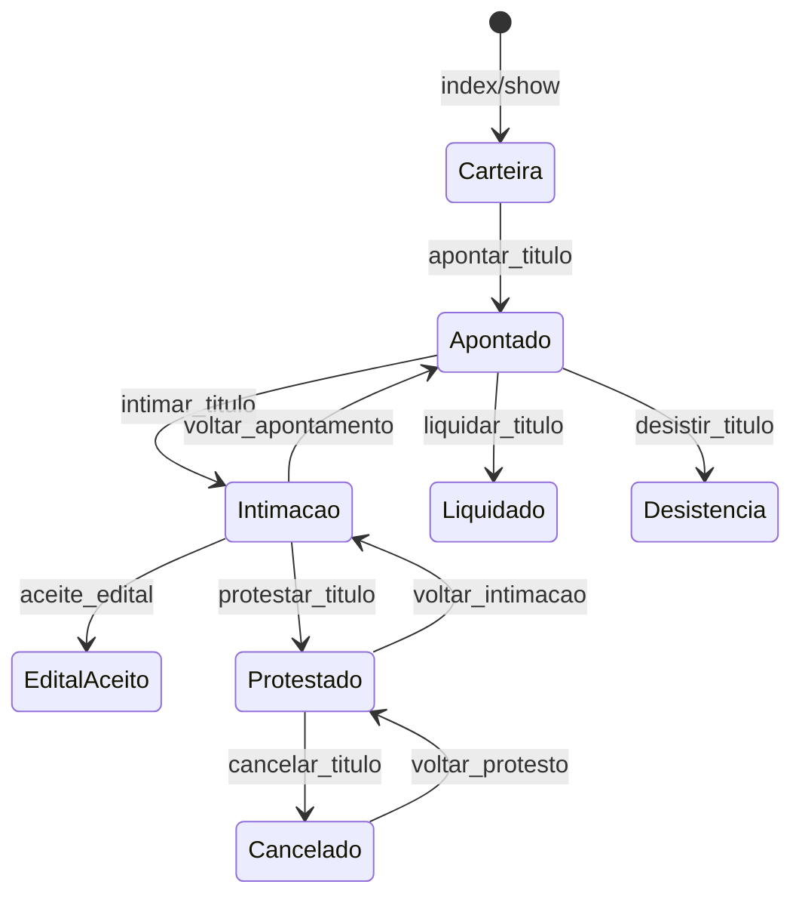

# Fluxo central — `PTitulo`

Fontes: `app/DATA_CONFIG_ENDPOINTS_FLUXO_EDITAL.md` (§11) e `app/src/packages/administrativo/data/PTitulo/ptituloDataConfig.ts`.

## Regra crítica de resposta (ações de botão)

Todo endpoint acionado por botão de ação no fluxo deve retornar em `data` o **título completo atualizado**, nunca payload parcial.

Fluxo esperado no frontend:

1. `PUT` ação → recebe título completo em `data` → re-render imediato
2. Opcional: `GET show` para revalidação

## Mapa de rotas (canônico DataConfig)

| Ação frontend | Método | Rota relativa (sob prefix `/administrativo/p_titulo`) | Service planejado |
|---------------|--------|------------------------------------------------------|-------------------|
| index | GET | `/` | `p_titulo_index_service` |
| show | GET | `/{id}/` | `p_titulo_show_service` |
| showDevedores | GET | `/devedores/{id}` | `p_titulo_show_devedores_service` |
| selos | GET | `/{id}/selos` | `p_titulo_selos_service` |
| updateStatus | PUT | `/{id}/status/` | `p_titulo_update_status_service` |
| proximoNumeroApontamento | GET | `/proximo_numero_apontamento/` | `p_titulo_proximo_numero_apontamento_service` |
| apontarTitulo | PUT | `/apontar_titulo/{id}` | `p_titulo_apontar_service` |
| intimarTitulo | PUT | `/intimar_titulo/{id}` | `p_titulo_intimar_service` |
| aceiteEdital | PUT | `/aceite_edital/{id}` | `p_titulo_aceite_edital_service` |
| voltarApontamento | PUT | `/voltar_apontamento/{id}` | `p_titulo_voltar_apontamento_service` |
| voltarIntimacao | PUT | `/voltar_intimacao/{id}` | `p_titulo_voltar_intimacao_service` |
| liquidarTitulo | PUT | `/liquidar_titulo/{id}` | `p_titulo_liquidar_service` |
| desistirTitulo | PUT | `/desistir_titulo/{id}` | `p_titulo_desistir_service` |
| cancelarTitulo | PUT | `/cancelar_titulo/{id}` | `p_titulo_cancelar_service` |
| voltarProtesto | PUT | `/voltar_protesto/{id}` | `p_titulo_voltar_protesto_service` |
| protestarTitulo | PUT | `/protestar_titulo/{id}` | `p_titulo_protestar_service` |
| sustarTitulo | PUT | `/sustar_titulo/{id}` | `p_titulo_sustar_service` |
| retiradaTitulo | PUT | `/retirada_titulo/{id}` | `p_titulo_retirada_service` |

Rotas `sustar` e `retirada` existem no DataConfig mas não no doc `DATA_CONFIG_ENDPOINTS_FLUXO_EDITAL.md` — **implementar** conforme mock/regras de negócio do app.

## Diagrama simplificado de fases



Cada transição exige validação no service (máquina de estados) + auditoria + retorno do título completo.

## Responsabilidades por ação (resumo do doc)

| Ação | Pré-condições principais | Efeitos |
|------|-------------------------|---------|
| apontar | sem andamento prévio | numero/data apontamento, ocorrência apontado |
| intimar | apontamento completo | datas de intimacao/prazos, ocorrência |
| aceite_edital | fase elegível | data/hora aceite, anti-duplicidade |
| protestar | intimacao/edital/prazo ok | livro/folha/numero/data protesto |
| cancelar | motivo obrigatório | bloqueio de evolução futura |
| desistir | motivo quando exigido | ocorrência final |
| liquidar | dados financeiros | encerra fluxo |
| voltar_* | estado reversível | limpar campos dependentes + justificativa |

## Estrutura de arquivos (além do CRUD)

Seguir [templates/template-matriz-arquivos-por-entidade.md](./templates/template-matriz-arquivos-por-entidade.md) com sufixo por ação:

```text
services/p_titulo/go/p_titulo_apontar_service.py
actions/p_titulo/p_titulo_apontar_action.py
repositories/p_titulo/p_titulo_apontar_repository.py
```

Controller `p_titulo_controller.py` expõe um método por ação; `p_titulo_endpoint.py` declara a rota.

## Dependências de cadastros

`p_titulo` depende de: `p_banco`, `p_especie`, `p_ocorrencias`, `p_motivos`, `p_motivos_cancelamento`, `p_pessoa`, `g_feriado` (prazos), livros — implementar cadastros na **Fase 1** antes das ações de fluxo.

## Testes planejados

- Unit: máquina de estados (transição válida/inválida → 409/422)
- Unit: retorno sempre inclui objeto título completo
- Integration: sequência apontar → intimar → aceite_edital → protestar (happy path)
- Integration: rollbacks (`voltar_*`)
